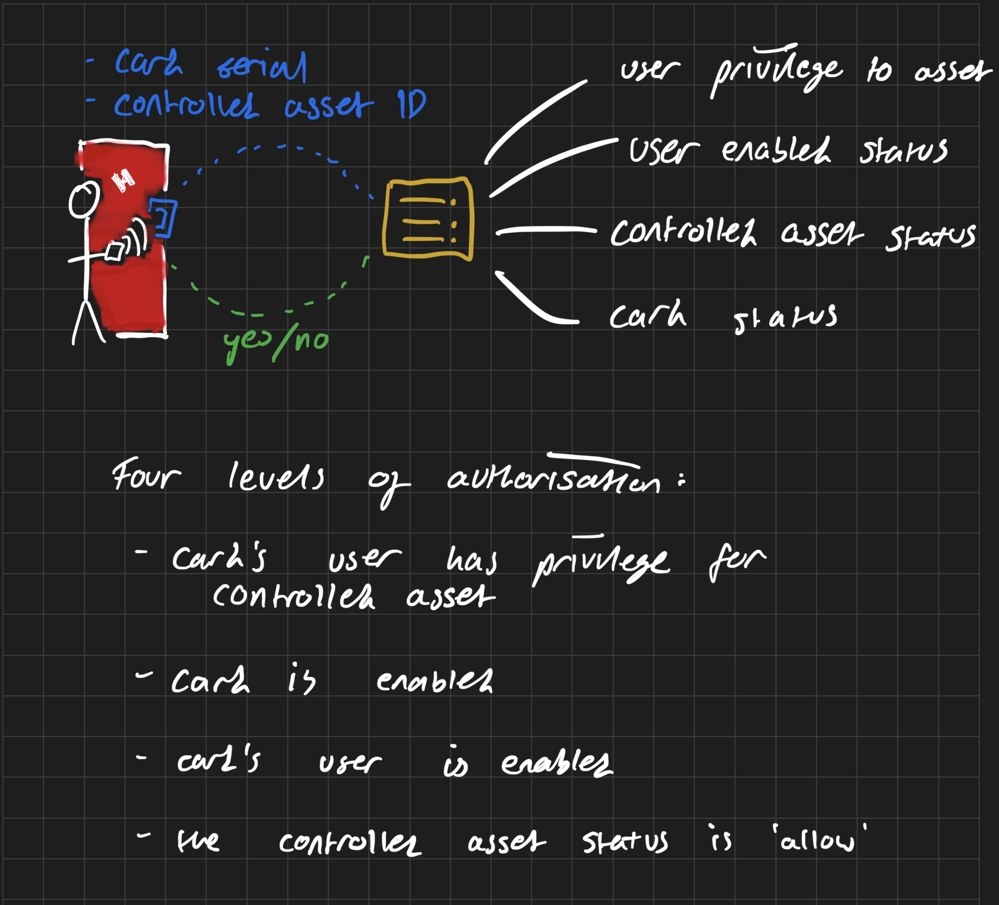

# DoorControlServer

An endpoint for door controllers running [rfidaccess-esp32-swift](https://github.com/ntflix/rfidaccess-esp32-swift) to consume for secure, centralised door access control. 

Designed around being simple, secure, and reliable.

Written in Swift using [Vapor](https://vapor.codes).

Four levels of authorisation:

1. Card's user has privilege for the access controlled asset
2. Card is enabled
3. Card's user is enabled
4. The access controlled asset status is 'allow'
